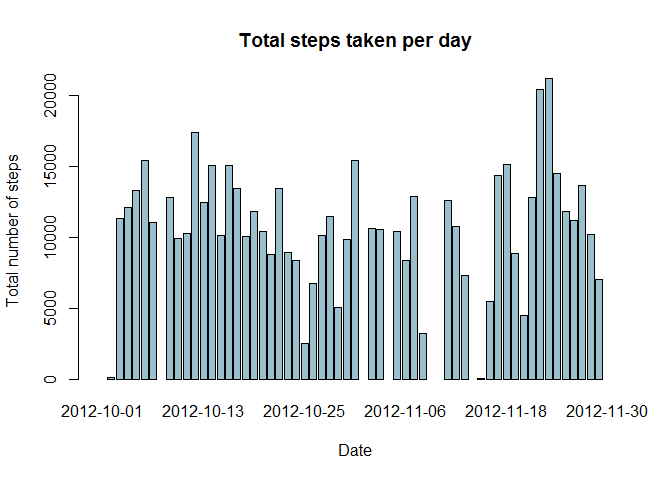
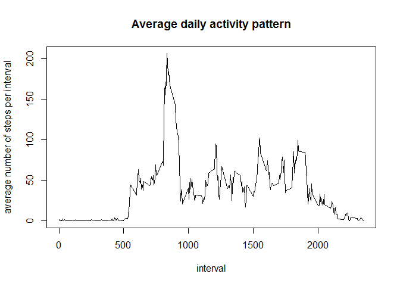
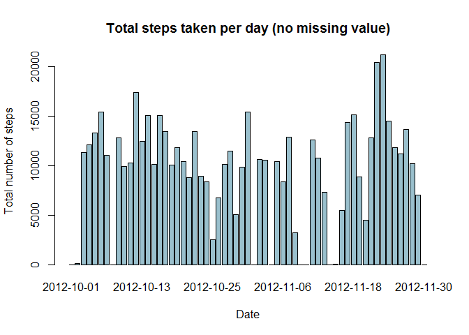
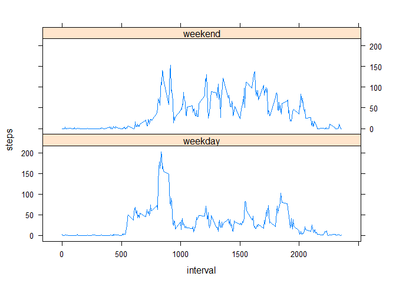

# Reproducible Research: Peer Assessment 1
Majea  
Tuesday, October 14, 2014  

## Introduction

It is now possible to collect a large amount of data about personal movement 
using activity monitoring devices such as a Fitbit, Nike Fuelband, or Jawbone 
Up. These type of devices are part of the "quantified self" movement - a group 
of enthusiasts who take measurements about themselves regularly to improve their
health, to find patterns in their behavior, or because they are tech geeks. 
But these data remain under-utilized both because the raw data are hard to 
obtain and there is a lack of statistical methods and software for processing 
and interpreting the data.

This assignment makes use of data from a personal activity monitoring device. 
This device collects data at 5 minute intervals through out the day. The data 
consists of two months of data from an anonymous individual collected during the
months of October and November, 2012 and include the number of steps taken 
in 5 minute intervals each day.

## Data

The data for this assignment can be downloaded from the course web site:

Dataset: [Activity monitoring data](https://d396qusza40orc.cloudfront.net/repdata%2Fdata%2Factivity.zip) [52K]

The variables included in this dataset are:

- steps: Number of steps taking in a 5-minute interval (missing values are coded
as NA)

- date: The date on which the measurement was taken in YYYY-MM-DD format

- interval: Identifier for the 5-minute interval in which measurement was taken

The dataset is stored in a comma-separated-value (CSV) file and there are a 
total of 17,568 observations in this dataset.

## Loading and preprocessing the data


We assume here that the dataset zip file is downloaded already and available in 
the current directory. Please refer to the link above to download the data. We 
will first load the data into memory. Some of the later operations will require 
a dataset without NA values, so we'll prepare a filtered version of the dataset 
without the NA values.


```r
Sys.setlocale("LC_TIME", "English") #make sure dates are in English
```

```
## [1] "English_United States.1252"
```

```r
library(plyr)
library(lattice)
unzip('activity.zip')
data <- read.csv('activity.csv')
data$date <- as.Date(data$date)
```


## What is mean total number of steps taken per day?

We will now evaluate the mean and median number of steps taken by day. Let's 
first have a look at the histogram of the number of steps taken by day. Then 
we'll evaluate the mean and median. NA values are ignored in both evaluations.


```r
sum <- tapply(data$steps, data$date, sum)
barplot(sum, main="Total steps taken per day", xlab="Date", 
        ylab="Total number of steps", col="lightblue3")
```

 

Dates for which no value is available (NA) are ignored in the following 
computation. In this analysis, missing values are ignored. 
We'll apply specific treatment on the NA values later.


```r
mean(sum, na.rm=TRUE)
```

```
## [1] 10766
```

```r
median(sum, na.rm=TRUE)
```

```
## [1] 10765
```


## What is the average daily activity pattern?

We will now have a look at the average number of steps taken per interval. 
In this analysis, missing values are ignored. 
We'll apply specific treatment on the NA values later.


```r
avg <- aggregate(data[, "steps"], list(interval = data$interval), mean, 
                 na.rm=TRUE)
with(avg, plot(interval, x, type="l", 
               ylab="average number of steps per interval"))
title(main = "Average daily activity pattern")
```

 

The interval that contains the maximum number of steps on the average is the 
following:


```r
avg[avg$x==max(avg$x),1]
```

```
## [1] 835
```

## Imputing missing values

We will now apply specific treatment to the missing (NA) values. Here is the 
number of missing values to treat in the *steps* column. 


```r
sum(is.na(data$steps))
```

```
## [1] 2304
```

Please notice there are only missing values for the *steps* column.


```r
sum(is.na(data$interval))
```

```
## [1] 0
```

```r
sum(is.na(data$date))
```

```
## [1] 0
```

We'll handle the missing values by replacing them by the mean value of the same 
day. We consider 0 steps where taken when we only have missing values for one 
full day. 


```r
# first calculate the mean per day
meanPerDay <- aggregate(data[,"steps"], list(date=data$date), mean, na.rm=TRUE)
colnames(meanPerDay) <- c("date", "meanPerDay")
meanPerDay[is.nan(meanPerDay$meanPerDay),2] <- 0
# then merge with the data table
merged <- merge(data, meanPerDay, by.x="date", by.y="date")
# and finally replace the missing values
merged[is.na(merged$steps), 2] <- merged[is.na(merged$steps), 4]
```

Here is a chart corresponding to the number of steps taken by day.


```r
sum_merged <- tapply(merged$steps, merged$date, sum)
barplot(sum_merged, main="Total steps taken per day (no missing value)", 
        xlab="Date", ylab="Total number of steps", col="lightblue3")
```

 

And here are the means and median with the missing values replaced


```r
mean(sum_merged, na.rm=TRUE)
```

```
## [1] 9354
```

```r
median(sum_merged, na.rm=TRUE)
```

```
## [1] 10395
```

As you can notice, both the graph and the median are the same as before. 
This is because the data set only holds missing values for completedays. 
Hence, all NA values were replaced by 0 values. This replacement has
the impact on our calculations as ignoring the missing values, which is what
we did our first calculations.


On the other side, the mean changed because the days that previously contained 
null values now count in the number of values.

## Are there differences in activity patterns between weekdays and weekends?

We will now identify what days in the data are week days and what are week-end 
days. This new information is added to our data.


```r
wd <- weekdays(merged$date)
wd[wd=="Monday"|wd=="Tuesday"|wd=="Wednesday"|wd=="Thursday"|
       wd=="Friday"] <- "weekday"
wd[wd=="Saturday"|wd=="Sunday"] <- "weekend"
wd <- factor(wd)
merged$dayofweek <- wd
```

Finally we'll compare the number of steps taken per interval averaged on week
days or week-end days. To do this, we'll first calculate the averages and 
then plot them.


```r
# the next line plots calculates the steps mean per 'interval' 
# and per 'dayofweek'
merged_avg <- ddply(merged, c("interval", "dayofweek"), 
                    function(df) mean(df$steps))
colnames(merged_avg) <- c("interval", "dayofweek", "steps")
xyplot(steps ~ interval | dayofweek, data=merged_avg, layout=c(1,2), type="l")
```

 

We can observe a slightly higher number of steps taken on week-end days 
for some intervals between 1000 and 2000 while the peak around interval 800 
is higher for week days.

